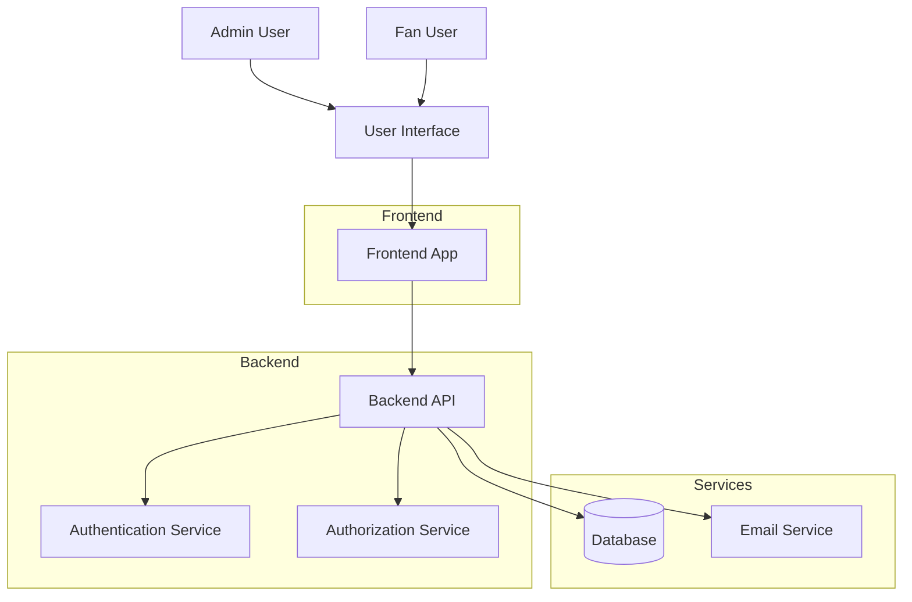
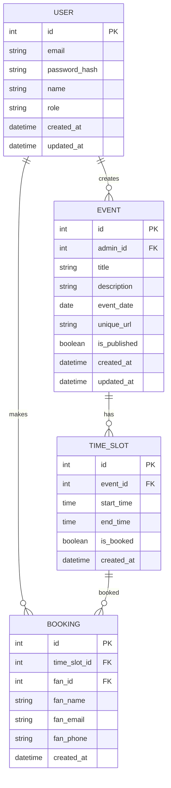
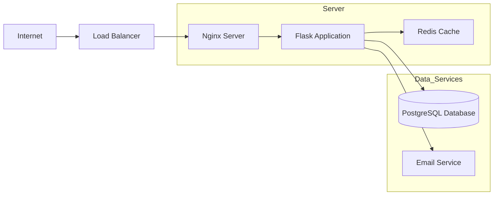

# Appointment Booking System - Architecture Design

## System Overview
This is a web-based appointment booking system that allows admins to create events with time slots and fans to book those slots. The system includes user authentication, event management, booking functionality, and notifications.

## Architecture Diagram

## Technology Stack

### Backend
- **Framework**: Flask (Python)
- **Database**: PostgreSQL (using SQLAlchemy ORM)
- **Authentication**: JWT (JSON Web Tokens)
- **Password Security**: Bcrypt
- **Email Service**: Flask-Mail (SMTP)
- **API Documentation**: Swagger/OpenAPI

### Frontend
- **Framework**: React.js
- **State Management**: Redux or Context API
- **Routing**: React Router
- **UI Components**: Material-UI or Tailwind CSS
- **HTTP Client**: Axios

### Deployment
- **Containerization**: Docker
- **Orchestration**: Docker Compose
- **Reverse Proxy**: Nginx
- **SSL**: Let's Encrypt

## Core Components

### 1. User Management
- User registration (email, password, role)
- User login/logout
- Password reset functionality
- Profile management
- Role-based access control (admin/fan)

### 2. Event Management
- Event creation (title, description, date)
- Time slot definition
- Event publishing
- Event listing and details
- Unique URL generation for events

### 3. Booking System
- Time slot availability checking
- Slot booking with fan information
- Concurrent booking protection
- Booking confirmation
- Booking management

### 4. Notification System
- Email notifications for bookings
- Admin notifications for new bookings
- Optional SMS notifications

### 5. Security Features
- HTTPS enforcement
- Input validation and sanitization
- Protection against SQL injection
- Protection against XSS and CSRF
- Secure password hashing
- JWT token management

## Database Schema Design

## API Endpoints

### Authentication
- `POST /api/auth/register` - User registration
- `POST /api/auth/login` - User login
- `POST /api/auth/logout` - User logout
- `POST /api/auth/refresh` - Refresh JWT token

### User Management
- `GET /api/users/profile` - Get user profile
- `PUT /api/users/profile` - Update user profile
- `PUT /api/users/password` - Change password

### Event Management (Admin only)
- `POST /api/events` - Create event
- `GET /api/events` - List all events for admin
- `GET /api/events/{id}` - Get event details
- `PUT /api/events/{id}` - Update event
- `DELETE /api/events/{id}` - Delete event
- `POST /api/events/{id}/publish` - Publish event
- `GET /api/events/{id}/bookings` - Get all bookings for event

### Event Viewing (Public/Fan)
- `GET /api/events/public` - List published events
- `GET /api/events/public/{url}` - Get event details by URL
- `GET /api/events/public/{url}/slots` - Get available time slots

### Booking (Fan only)
- `POST /api/bookings` - Create booking
- `GET /api/bookings` - List user's bookings
- `GET /api/bookings/{id}` - Get booking details
- `DELETE /api/bookings/{id}` - Cancel booking

## Security Considerations

1. **Authentication & Authorization**
   - JWT tokens for stateless authentication
   - Role-based access control (RBAC)
   - Token expiration and refresh mechanisms

2. **Data Protection**
   - Passwords hashed with bcrypt
   - Input validation and sanitization
   - Parameterized queries to prevent SQL injection
   - XSS protection through proper output encoding

3. **Network Security**
   - HTTPS enforcement
   - CORS configuration
   - CSRF protection for state-changing operations

4. **Application Security**
   - Rate limiting to prevent abuse
   - Secure headers implementation
   - Error handling without information leakage

## Concurrency Handling

To prevent double-booking of time slots:
1. Database-level constraints to ensure uniqueness
2. Transaction isolation levels to prevent race conditions
3. Optimistic or pessimistic locking mechanisms
4. Proper error handling for concurrent access scenarios

## Deployment Architecture

## Scalability Considerations

1. **Database Optimization**
   - Proper indexing on frequently queried fields
   - Connection pooling
   - Read replicas for scaling read operations

2. **Caching**
   - Redis for session storage
   - Caching of frequently accessed data (events, time slots)

3. **Horizontal Scaling**
   - Stateless application design
   - Load balancing across multiple instances
   - Shared session storage

4. **Asynchronous Processing**
   - Background jobs for email notifications
   - Task queues for heavy processing