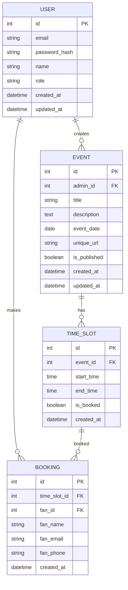

# Database Schema Design

## Overview
This document details the database schema for the appointment booking system. The schema includes tables for users, events, time slots, and bookings with appropriate relationships and constraints.

## Entity Relationship Diagram



## Table Definitions

### 1. Users Table

| Column Name | Data Type | Constraints | Description |
|-------------|-----------|-------------|-------------|
| id | SERIAL | PRIMARY KEY | Unique identifier for the user |
| email | VARCHAR(255) | NOT NULL, UNIQUE | User's email address |
| password_hash | VARCHAR(255) | NOT NULL | Bcrypt hashed password |
| name | VARCHAR(255) | NOT NULL | User's full name |
| role | VARCHAR(50) | NOT NULL, CHECK IN ('admin', 'fan') | User role (admin or fan) |
| created_at | TIMESTAMP | NOT NULL, DEFAULT CURRENT_TIMESTAMP | Record creation timestamp |
| updated_at | TIMESTAMP | NOT NULL, DEFAULT CURRENT_TIMESTAMP | Record last update timestamp |

**Indexes:**
- Unique index on email
- Index on role for filtering users by role

### 2. Events Table

| Column Name | Data Type | Constraints | Description |
|-------------|-----------|-------------|-------------|
| id | SERIAL | PRIMARY KEY | Unique identifier for the event |
| admin_id | INTEGER | NOT NULL, FOREIGN KEY REFERENCES users(id) | ID of the admin who created the event |
| title | VARCHAR(255) | NOT NULL | Event title |
| description | TEXT |  | Event description |
| event_date | DATE | NOT NULL | Date of the event |
| unique_url | VARCHAR(255) | NOT NULL, UNIQUE | Unique URL slug for the event |
| is_published | BOOLEAN | NOT NULL, DEFAULT FALSE | Whether the event is published |
| created_at | TIMESTAMP | NOT NULL, DEFAULT CURRENT_TIMESTAMP | Record creation timestamp |
| updated_at | TIMESTAMP | NOT NULL, DEFAULT CURRENT_TIMESTAMP | Record last update timestamp |

**Indexes:**
- Unique index on unique_url
- Index on admin_id for filtering events by admin
- Index on event_date for date-based queries
- Index on is_published for filtering published events

### 3. Time Slots Table

| Column Name | Data Type | Constraints | Description |
|-------------|-----------|-------------|-------------|
| id | SERIAL | PRIMARY KEY | Unique identifier for the time slot |
| event_id | INTEGER | NOT NULL, FOREIGN KEY REFERENCES events(id) ON DELETE CASCADE | ID of the event this slot belongs to |
| start_time | TIME | NOT NULL | Start time of the slot |
| end_time | TIME | NOT NULL | End time of the slot |
| is_booked | BOOLEAN | NOT NULL, DEFAULT FALSE | Whether the slot is booked |
| created_at | TIMESTAMP | NOT NULL, DEFAULT CURRENT_TIMESTAMP | Record creation timestamp |

**Indexes:**
- Index on event_id for filtering slots by event
- Index on is_booked for filtering available slots
- Composite index on event_id and is_booked for efficient availability queries

**Constraints:**
- Check constraint to ensure start_time < end_time
- Unique constraint on (event_id, start_time, end_time) to prevent duplicate slots

### 4. Bookings Table

| Column Name | Data Type | Constraints | Description |
|-------------|-----------|-------------|-------------|
| id | SERIAL | PRIMARY KEY | Unique identifier for the booking |
| time_slot_id | INTEGER | NOT NULL, FOREIGN KEY REFERENCES time_slots(id) ON DELETE CASCADE | ID of the booked time slot |
| fan_id | INTEGER | NOT NULL, FOREIGN KEY REFERENCES users(id) | ID of the fan who made the booking |
| fan_name | VARCHAR(255) | NOT NULL | Name of the fan |
| fan_email | VARCHAR(255) | NOT NULL | Email of the fan |
| fan_phone | VARCHAR(50) | NOT NULL | Phone number of the fan |
| created_at | TIMESTAMP | NOT NULL, DEFAULT CURRENT_TIMESTAMP | Record creation timestamp |

**Indexes:**
- Index on time_slot_id for filtering bookings by slot
- Index on fan_id for filtering bookings by fan
- Index on created_at for time-based queries

**Constraints:**
- Unique constraint on time_slot_id to prevent double booking

## Relationships

1. **Users to Events**: One-to-Many (One admin can create many events)
2. **Events to Time Slots**: One-to-Many (One event can have many time slots)
3. **Time Slots to Bookings**: One-to-One (One time slot can have one booking)
4. **Users to Bookings**: One-to-Many (One fan can make many bookings)

## Triggers

1. **Update Timestamps**: Before update triggers on all tables to automatically update the `updated_at` field
2. **Booking Creation**: After insert trigger on bookings to automatically set `is_booked = TRUE` on the corresponding time slot
3. **Booking Cancellation**: After delete trigger on bookings to automatically set `is_booked = FALSE` on the corresponding time slot

## Concurrency Considerations

To handle concurrent bookings and prevent race conditions:

1. **Transaction Isolation**: Use appropriate isolation levels (REPEATABLE READ or SERIALIZABLE) for booking operations
2. **Explicit Locking**: Use SELECT FOR UPDATE when checking slot availability and creating bookings
3. **Database Constraints**: Rely on the unique constraint on time_slot_id in the bookings table as a final safeguard against double booking

## Sample Queries

### Get Available Time Slots for an Event
```sql
SELECT ts.id, ts.start_time, ts.end_time
FROM time_slots ts
WHERE ts.event_id = ? AND ts.is_booked = FALSE
ORDER BY ts.start_time;
```

### Get All Bookings for an Event (Admin View)
```sql
SELECT b.id, b.fan_name, b.fan_email, b.fan_phone, b.created_at,
       ts.start_time, ts.end_time
FROM bookings b
JOIN time_slots ts ON b.time_slot_id = ts.id
JOIN events e ON ts.event_id = e.id
WHERE e.id = ?
ORDER BY ts.start_time;
```

### Get User's Bookings
```sql
SELECT b.id, b.created_at, b.fan_name, b.fan_email, b.fan_phone,
       ts.start_time, ts.end_time,
       e.title, e.event_date
FROM bookings b
JOIN time_slots ts ON b.time_slot_id = ts.id
JOIN events e ON ts.event_id = e.id
WHERE b.fan_id = ?
ORDER BY e.event_date, ts.start_time;
```

## Performance Considerations

1. **Indexes**: Proper indexing on foreign keys and frequently queried columns
2. **Query Optimization**: Use JOINs efficiently and avoid N+1 query problems
3. **Pagination**: Implement pagination for large result sets
4. **Caching**: Cache frequently accessed data like published events