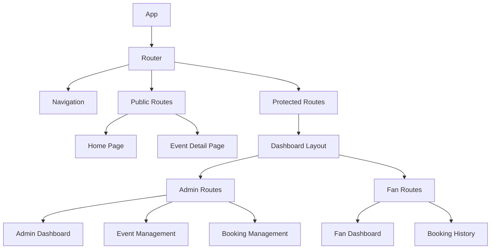

# Frontend Design

## Overview
This document outlines the frontend architecture, component structure, and user interface designs for the appointment booking system. The frontend will be built using React.js with a modern, responsive design.

## Technology Stack
- **Framework**: React.js (v18+)
- **State Management**: React Context API with useReducer
- **Routing**: React Router v6
- **UI Components**: Material-UI (MUI) for consistent design system
- **HTTP Client**: Axios for API requests
- **Form Handling**: React Hook Form for form validation
- **Date/Time**: date-fns for date manipulation
- **Styling**: CSS Modules with responsive design principles

## Architecture

### Folder Structure
```
src/
├── components/          # Reusable UI components
├── pages/              # Page components
├── hooks/              # Custom React hooks
├── context/            # React context providers
├── services/           # API service functions
├── utils/              # Utility functions
├── assets/             # Images, icons, etc.
├── styles/             # Global styles and themes
└── App.js              # Main app component
```

### Component Hierarchy



## User Interfaces

### 1. Authentication Pages

#### Login Page
- Email and password fields
- "Remember me" checkbox
- "Forgot password" link
- "Don't have an account? Sign up" link
- Form validation and error handling
- Loading state during authentication

#### Registration Page
- Name, email, password fields
- Role selection (admin/fan)
- Password confirmation
- Terms and conditions agreement
- Form validation and error handling
- Loading state during registration

#### Password Reset Page
- Email input field
- Instructions for password reset
- Success message after submission

### 2. Public Pages

#### Home Page
- Header with navigation
- Hero section with app description
- List of published events (with pagination)
- Search/filter by date functionality
- Call-to-action buttons
- Footer with contact information

#### Event Detail Page
- Event title, description, and date
- Calendar view or list of available time slots
- Booking form (name, email, phone) for unauthenticated users
- "Book Now" button for each available time slot
- Success/error messages after booking

### 3. Admin Pages

#### Admin Dashboard
- Welcome message with admin name
- Summary cards:
  - Total events created
  - Total bookings received
  - Upcoming events count
- Quick actions:
  - Create new event
  - View all events
  - View all bookings
- Recent activity feed

#### Event Management

##### Create Event Page
- Event title input
- Event description textarea
- Date picker for event date
- Time slot creator:
  - Add multiple time slots with start/end times
  - Remove time slots
  - Validation for time conflicts
- "Save as Draft" and "Publish" buttons
- Preview of event URL

##### Events List Page
- Table of all events with:
  - Title
  - Date
  - Published status
  - Bookings count
  - Actions (edit, view, delete, publish/unpublish)
- Pagination controls
- Filter by published status
- Search by title

##### Edit Event Page
- Same fields as create event
- Pre-populated with existing event data
- Ability to add/remove time slots
- "Save Changes" and "Publish/Unpublish" buttons

#### Booking Management

##### Event Bookings Page
- Event title and details
- Table of all bookings for the event:
  - Fan name
  - Fan email
  - Fan phone
  - Time slot
  - Booking date
- Export to CSV functionality
- Search/filter bookings

### 4. Fan Pages

#### Fan Dashboard
- Welcome message with fan name
- Summary cards:
  - Total bookings made
  - Upcoming bookings count
- List of upcoming bookings
- Quick link to browse events

#### Booking History Page
- Table of all bookings made by the fan:
  - Event title
  - Event date
  - Time slot
  - Booking date
- "Cancel Booking" button for future bookings
- Pagination controls

#### Book Event Page
- Same as public event detail page but with pre-filled user information
- Ability to modify booking details before confirming

## Component Design

### Reusable Components

#### Header
- Logo
- Navigation links (conditional based on authentication status)
- User profile dropdown (for authenticated users)
- Responsive hamburger menu for mobile

#### Footer
- Copyright information
- Links to terms, privacy policy
- Social media links
- Contact information

#### Event Card
- Event title
- Event date
- Short description
- "View Details" button
- Published status indicator (for admin)

#### Time Slot Selector
- Visual representation of available time slots
- Color-coded status (available/booked)
- Selection mechanism
- Responsive grid layout

#### Booking Form
- Name input
- Email input
- Phone input
- Form validation
- Submit button
- Loading state

#### Pagination
- Previous/next buttons
- Page number links
- Current page indicator
- Total pages count

#### Notification Toast
- Success, error, warning, info variants
- Auto-dismiss functionality
- Manual dismiss option
- Positioning (top-right, bottom, etc.)

## State Management

### Global State
- User authentication status
- User profile information
- Notification messages
- Loading states for API calls

### Page-Level State
- Form data
- API response data
- UI interaction states (e.g., modal visibility)

## Routing

### Public Routes
- `/` - Home page
- `/events/:url` - Event detail page
- `/login` - Login page
- `/register` - Registration page
- `/reset-password` - Password reset page

### Protected Routes (Admin)
- `/admin/dashboard` - Admin dashboard
- `/admin/events` - Events list
- `/admin/events/create` - Create event
- `/admin/events/:id/edit` - Edit event
- `/admin/events/:id/bookings` - Event bookings

### Protected Routes (Fan)
- `/fan/dashboard` - Fan dashboard
- `/fan/bookings` - Booking history

## Responsive Design

### Breakpoints
- Mobile: < 768px
- Tablet: 768px - 1024px
- Desktop: > 1024px

### Design Considerations
- Flexible grid layouts
- Scalable vector icons
- Touch-friendly controls
- Readable font sizes
- Adequate spacing for different devices

## Accessibility

### WCAG Compliance
- Proper color contrast ratios
- Semantic HTML structure
- Keyboard navigation support
- Screen reader compatibility
- Focus management

### ARIA Attributes
- Descriptive labels for interactive elements
- Status announcements for dynamic content
- Landmark regions for page structure

## Performance Considerations

### Code Splitting
- Route-based code splitting
- Component lazy loading
- Dynamic imports for non-critical resources

### Optimization Techniques
- Image compression and modern formats (WebP)
- Bundle size monitoring
- Caching strategies
- Lazy loading for non-critical resources

## User Experience Principles

### Loading States
- Skeleton screens for data fetching
- Progress indicators for long operations
- Optimistic updates for immediate feedback

### Error Handling
- User-friendly error messages
- Clear call-to-action for recovery
- Automatic error reporting

### Feedback Mechanisms
- Visual feedback for interactions
- Confirmation dialogs for destructive actions
- Success messages for completed actions